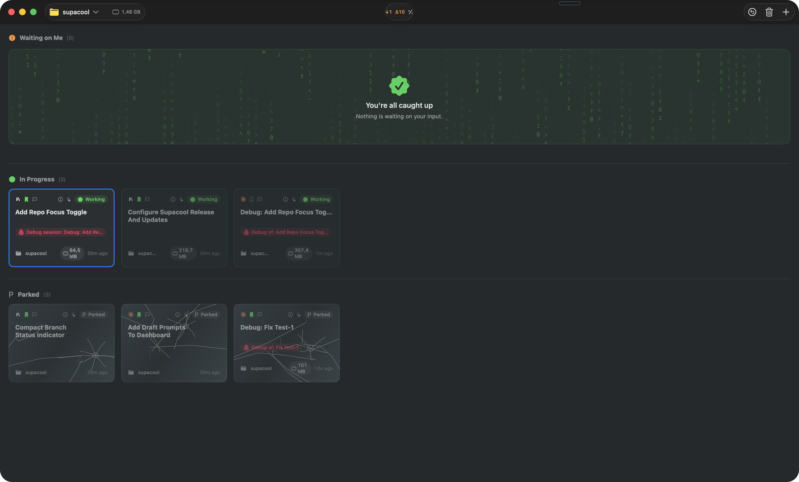

# Supacool

Native macOS command center for terminal coding agents.



Supacool turns Claude Code, Codex, and shell sessions into persistent workspace cards: start work, watch progress, jump into a full terminal, park sessions, and resume after relaunches without losing context.

## Features

- **Matrix Board** — a Kanban-style grid of agent sessions with "Waiting on Me" and "In Progress" buckets at a glance
- **Full-screen terminal per session** with inline diff-tool, split-shell (⌘E to toggle), and session-info affordances
- **Native macOS terminal** powered by [Ghostty](https://github.com/ghostty-org/ghostty)
- **Worktree-native sessions** — create and manage Git worktrees per session
- **First-class agents** — Claude Code, Codex, and plain shell sessions
- **Auto-resume** — sessions survive app restarts and upgrades; no more losing a running agent to a relaunch
- **Park / unpark** — free the PTY but keep the session metadata, and bring it back with one click when you're ready
- **⌘⌥-arrow session switcher** — ⌘-Tab-style overlay that cycles through sessions, grouped by Waiting and Working
- **New session from a pasted PR URL** — paste a GitHub PR URL and Supacool matches the repo, forces worktree mode, and pre-fills the PR's head branch
- **Unified workspace picker** — one search combo box covering repo root, existing worktrees, local + remote branches, and new-branch creation
- **AI-assisted branch names** — a wand button in the workspace picker generates a kebab-case branch name from the session prompt
- **Skill autocomplete in the prompt** — type `/` (Claude Code) or `$` (Codex) to browse and insert project and user skills inline
- **Auto-Observer** — per-session idle watcher that uses a small LLM to auto-respond to obvious prompts, so overnight runs don't stall on a yes/no dialog
- **Ticket & PR chips** — Linear ticket ids and GitHub PR URLs are parsed from the session transcript and surfaced on the card as clickable chips
- **GitHub pull-request integration** — status, merge, and review workflows where you work
- **Pre-worktree fetch** so fresh branches are based on the actually-latest upstream, not your local cache
- **Setup-script env vars** (`SUPACOOL_REPO_ROOT`, `SUPACOOL_WORKTREE_ROOT`) let your repo's own CLIs orient themselves from inside a freshly-created worktree
- **Sparkle auto-updates** for signed release builds

## Technical Stack

- [The Composable Architecture](https://github.com/pointfreeco/swift-composable-architecture)
- [libghostty](https://github.com/ghostty-org/ghostty)
- [Sparkle](https://sparkle-project.org)

## Requirements

- macOS 26.0+
- [mise](https://mise.jdx.dev/) (for dependencies)

## Building

```bash
make build-ghostty-xcframework   # Build GhosttyKit from Zig source
make build-app                   # Build macOS app (Debug)
make run-app                     # Build and launch
```

## Development

```bash
make check     # Run swiftformat and swiftlint
make test      # Run tests
make format    # Run swift-format
```

## Contributing

- I actually prefer a well written issue describing features/bugs u want rather than a vibe-coded PR
- I review every line personally and will close if I feel like the quality is not up to standard

## Origins

Supacool was originally derived from [supabitapp/supacode](https://github.com/supabitapp/supacode) at v0.8.0. It is now independently maintained, with its own product direction, release process, and repository.

## License

FSL-1.1-ALv2. See [LICENSE](LICENSE).
